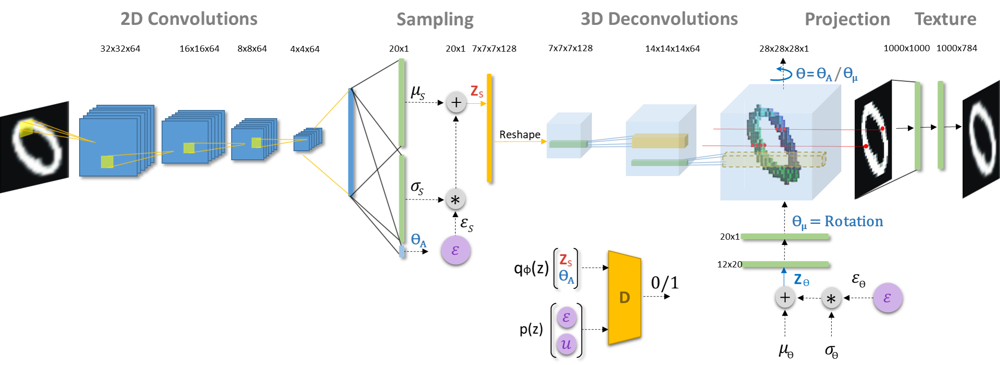
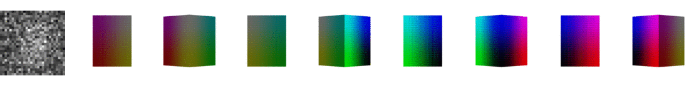
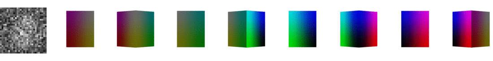
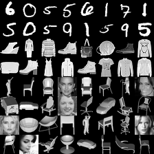
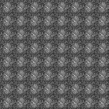
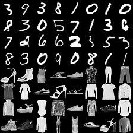

# uVAE
3D-VAE: Unsupervised learning of 3D shapes from single images. 

## 3D VAE Architecture:

**Figure-1:**

## Sample shapes learned during training:

Below are the shapes of digits 2, 3, and 5 from MNIST dataset learned during training.

**Figure-2:**  3D shapes of digits and fashion items learned during training. From top to bottom, the shapes are the digits 2, 3, 5 and the fashion items pants, shirt and shoe.The model is trained on a combined datasets consisting of MNIST, MNIST Fashion, CelebA, and several categories of ModelNet40, and hence we see that the shapes resemble fashion items, or human faces at the initial period of training.

## Rendered images from learned 3D shapes during training:

|Input Data|Rendered images during training|
|:----------------------:|:--------------------------------:|
|  |  |
|  |  |

**Figure-2:** Input data and corresponding rendered images from learned 3D shapes during training. The model is trained on a combined datasets consisting of MNIST, MNIST Fashion, CelebA, and several categories of ModelNet40.

## More:

For more examples, please see: [3D-VAE, uVAE, demo page](https://pilatracu.github.io/3dvae/ "3D-VAE demo page")   
